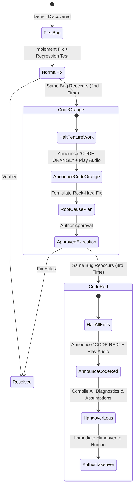
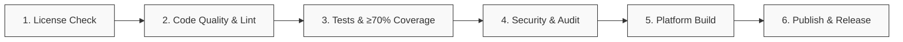

# The AI Agent Constitution & Binding Amendments

[](#ratification--the-frozen-core)
[](#core-philosophy--scope)
[](#3-software-craftsmanship--testing-rigor)
[](#4-agile-architecture--git-flow)
[](#cicd-ordered-gates)

> **A stack-agnostic, project-agnostic constitutional framework and operational specification for autonomous AI coding agents.**

---

## Table of Contents

- [Overview & Purpose](#overview--purpose)
- [Core Philosophy & Scope](#core-philosophy--scope)
- [Ratification & The Frozen Core](#ratification--the-frozen-core)
- [The 20 Ratified Amendments](#the-20-ratified-amendments)
  - [1. Operational Discipline & Communication](#1-operational-discipline--communication)
  - [2. Safety, Permissions & Asset Protection](#2-safety-permissions--asset-protection)
  - [3. Software Craftsmanship & Testing Rigor](#3-software-craftsmanship--testing-rigor)
  - [4. Agile Architecture & Git Flow](#4-agile-architecture--git-flow)
  - [5. Ambient Feedback & Tooling](#5-ambient-feedback--tooling)
- [Lifecycle Workflows & Architecture](#lifecycle-workflows--architecture)
  - [The Development Triplet Workflow](#the-development-triplet-workflow)
  - [Regression Escalation Protocol](#regression-escalation-protocol)
  - [CI/CD Ordered Gates](#cicd-ordered-gates)
- [Project Layout & Artifact Standards](#project-layout--artifact-standards)
  - [The `agile/` Work Item Triplet](#the-agile-work-item-triplet)
  - [Branch Naming Taxonomy](#branch-naming-taxonomy)
  - [Audio State Dispatcher](#audio-state-dispatcher)
- [Agent Operational Quick Reference](#agent-operational-quick-reference)
- [Adopting in Your Repositories](#adopting-in-your-repositories)
  - [1. Link the Central Constitution](#1-link-the-central-constitution)
  - [2. Multi-Harness Configuration Snippets](#2-multi-harness-configuration-snippets)
- [Contributing & Amendment Lifecycle](#contributing--amendment-lifecycle)
- [License](#license)

---

## Overview & Purpose

As autonomous AI coding agents take on complex engineering tasks across multi-repository workspaces, informal prompting strategies frequently yield systemic failure modes:
- **Unverified Assumptions:** Agents infer ambiguous business requirements rather than requesting clarification.
- **Destructive File Operations:** Execution of unvetted commands (`rm -rf`, hard resets) destroys authored or uncommitted assets.
- **Quality Erosion:** Implementations bypass version control discipline and test coverage minimums.
- **Superficial Patching:** Regressions receive symptom-level patches without root-cause analysis.
- **Documentation Drift:** Living documentation lags behind codebase evolution.

**The AI Agent Constitution ([`AMENDMENTS.md`](./AMENDMENTS.md))** establishes a single, binding source of operational governance. It defines mandatory operational rules governing file system manipulation, version control, automated testing, continuous integration gates, and human escalation protocols.

---

## Core Philosophy & Scope

1. **Stack and Platform Independence:** Specifies invariant properties of correct execution rather than language-specific or vendor-specific tooling.
2. **Centralized Governance:** Maintained within a central repository (`AI_Docs` / `constitution`) and referenced downstream via `docs/AMENDMENTS.md`. Divergent local copies are prohibited.
3. **Additive Evolution:** New amendments cannot implicitly override or invalidate earlier rules. All amendments and formal repeals require explicit documentation.
4. **Systemic Composability:** Amendments function as an integrated operational specification rather than an isolated checklist.

---

## Ratification & The Frozen Core

As of **2026-08-14**, **Amendments 1 through 20 are permanently ratified and frozen**.
- **Prohibition on Modification:** Autonomous agents must not reword, clarify, soften, or alter frozen amendments.
- **Conflict Precedence:** If a requested task requires an action prohibited by a frozen amendment, the agent must immediately pause execution, identify the precise conflict, and await explicit human instruction.

---

## The 20 Ratified Amendments

*Full canonical text and legal specification available in [`AMENDMENTS.md`](./AMENDMENTS.md).*

### 1. Operational Discipline & Communication

| # | Amendment | Core Mandate |
|---|---|---|
| **1** | [**Mandatory Briefing Format & Turn Verification**](./AMENDMENTS.md#amendment-1--mandatory-briefing-format-and-turn-verification) | Pre-execution signal verification on every turn; numbered, concise, article-stripped responses to allow direct line referencing. |
| **2** | [**Critique First, Never Assume, Warn on Harm**](./AMENDMENTS.md#amendment-2--critique-first-never-assume-warn-on-harm) | Critique requests against project architecture prior to implementation; execute questionnaires for ambiguous specifications; warn on architectural debt, data loss, or security risks. |
| **4** | [**No Visual Testing / Input Hijacking Without the Wheel**](./AMENDMENTS.md#amendment-4--no-visual-testing-or-input-hijacking-without-the-wheel) | Default strictly to headless verification. Prohibit browser automation, UI interaction, or window-focus manipulation unless explicit control is granted (*"I leave the wheel for you"*). |
| **8** | [**Common Sense First; Ask Only for Author-Owned Decisions**](./AMENDMENTS.md#amendment-8--common-sense-first-ask-only-for-author-owned-decisions) | Independently resolve *craft unknowns* (idiomatic syntax, standard file placement); prompt the author solely for *author-owned decisions* (business logic, architecture trade-offs, scope). |

### 2. Safety, Permissions & Asset Protection

| # | Amendment | Core Mandate |
|---|---|---|
| **5** | [**Try Hard Before Asking; Sudo is Granted**](./AMENDMENTS.md#amendment-5--try-hard-before-asking-sudo-is-granted) | Exhaust reasonable operational alternatives prior to escalation. Passwordless `sudo` is logged to `~/.claude/sudo-commands` via append-only hooks. |
| **6** | [**Zero-Deletion Policy & Command Safety**](./AMENDMENTS.md#amendment-6--nothing-is-deleted-nothing-dangerous-is-run) | Authored content is **never deleted**. Deprecated files are moved to `~/claudetrashbin` for human review. Dangerous system commands (`dd`, `mkfs`, raw piping into bash, network tampering) are strictly prohibited. |
| **17** | [**Installed CLIs for Version Control**](./AMENDMENTS.md#amendment-17--use-the-installed-clis-for-all-version-control-work) | Execute all version control operations through installed Git and GitHub CLI (`gh`) binaries. Repository state must be read directly from tooling. |

### 3. Software Craftsmanship & Testing Rigor

| # | Amendment | Core Mandate |
|---|---|---|
| **3** | [**Plan Mode for Multi-Step Work**](./AMENDMENTS.md#amendment-3--plan-mode-for-multi-step-work) | Requests resolving into >3 distinct tasks or high architectural risk require formal plan creation prior to editing files. Approved plans define strict scope boundaries. |
| **7** | [**Craft: Clean Code, Right-Sized Architecture**](./AMENDMENTS.md#amendment-7--craft-clean-code-right-sized-architecture) | Strict adherence to SOLID and DRY principles. Prohibit dead code, god objects, and speculative over-engineering. |
| **9** | [**Regression Escalation Protocol**](./AMENDMENTS.md#amendment-9--regression-escalation-code-orange-then-code-red) | **1st occurrence:** Standard fix with regression test. <br>**2nd occurrence (`CODE ORANGE`):** Halt feature development, isolate root cause, formulate verified fix. <br>**3rd occurrence (`CODE RED`):** Halt all edits and provide full diagnostic handover to human author. |
| **10** | [**Test Coverage Floor: 70%**](./AMENDMENTS.md#amendment-10--test-coverage-floor-70-of-our-own-code) | Maintain a minimum **70% test coverage floor** on first-party code across all application layers. Disallow unasserted test execution. |

### 4. Agile Architecture & Git Flow

| # | Amendment | Core Mandate |
|---|---|---|
| **11** | [**`docs/` Exists & Stays True**](./AMENDMENTS.md#amendment-11--docs-exists-in-every-repository-and-stays-true) | Maintain living architectural specifications and decision records in `docs/`. Documentation drift is classified as a defect; docs update within the same commit. |
| **12** | [**`agile/` Work Item Triplets**](./AMENDMENTS.md#amendment-12--agile-holds-work-items-plans-and-test-plans) | Enforce standardized tracking trees using `FEAT-###`, `TASK-###`, and `BUG-###`. Maintain complete work item triplets (Item, Plan, and dual Test Plans). |
| **13** | [**Conventional Branch Isolation**](./AMENDMENTS.md#amendment-13--a-branch-per-work-item-named-conventionally) | One branch per work item (`feature/FEAT-###-desc`, `bugfix/BUG-###-desc`). All branches branch from `dev` (hotfixes branch from `main`). |
| **14** | [**Git Flow & PR-Only Gateways**](./AMENDMENTS.md#amendment-14--git-flow-protected-branches-prs-only) | `main` and `dev` are protected. Direct commits and fast-forward pushes are prohibited. Destructive Git commands require explicit author authorization. |
| **15** | [**Release Builds Strategy**](./AMENDMENTS.md#amendment-15--release-builds-automatic-on-main-manual-on-dev) | Merges into `main` automatically publish tagged production releases. Merges into `dev` validate quality gates with manual pre-release build triggers. |
| **16** | [**Ordered CI/CD Pipeline Gates**](./AMENDMENTS.md#amendment-16--cicd-ordered-gates) | Sequential blocking verification gates: (1) License Check → (2) Code Quality → (3) Tests & Coverage → (4) Security Audit → (5) Build → (6) Release. |
| **18** | [**Session Start: Review Open PRs**](./AMENDMENTS.md#amendment-18--session-start-review-open-pull-requests-first) | Summarize open pull requests, CI gate statuses, and potential merge conflicts at the start of each workspace session. |

### 5. Ambient Feedback & Tooling

| # | Amendment | Core Mandate |
|---|---|---|
| **19** | [**Audio Signals for Critical States**](./AMENDMENTS.md#amendment-19--audio-signals-for-states-that-need-the-author) | Dispatch non-blocking background audio notifications for milestone states requiring attention: `FINISHED`, `NEED_INTERACTION`, `CONFLICT`, `CODE_ORANGE`, `CODE_RED`. |
| **20** | [**Sound Catalogue as Structured Data**](./AMENDMENTS.md#amendment-20--the-sound-catalogue-is-data-and-stays-in-sync) | Maintain audio assets under the configured sound directory named after system states in `SCREAMING_SNAKE_CASE` (any supported audio format), mapped 1-to-1 with registered events. |

---

## Lifecycle Workflows & Architecture

### The Development Triplet Workflow

Every feature, task, or bug fix follows a deterministic lifecycle:


---

### Regression Escalation Protocol

When defects recur, execution transitions through the escalation tiers of Amendment 9:



---

### CI/CD Ordered Gates

All pull requests pass through strict sequential gates defined in Amendment 16:



- **`dev` Target:** Executes Gates 1 through 4. Platform build and alpha release execution are triggered manually.
- **`main` Target:** Executes Gates 1 through 6 sequentially. Successful completion triggers automated release artifact generation and tagging.

---

## Project Layout & Artifact Standards

Every downstream repository managed under these amendments adopts the standard filesystem structure:

```
<project-root>/
├── .github/
│   └── workflows/ci.yml       # Ordered CI/CD Pipeline (Amendment 16)
├── agile/                     # Amendment 12: Work Tracking
│   ├── items/                 # Specifications & Acceptance Criteria (FEAT-###, TASK-###, BUG-###)
│   ├── plans/                 # Architectural & Implementation Plans
│   └── testing/               # Dual Test Plans:
│       ├── <ID>-automated.md  # Automated assertion logs & coverage reports
│       └── <ID>-sweep.md      # Manual step-by-step human test tickets
├── docs/                      # Amendment 11: Persistent Documentation
│   ├── AMENDMENTS.md          # Reference pointer to central constitution
│   ├── architecture/          # ADRs, Module Boundaries, Data Flows
│   └── ci-cd.md               # Pipeline gate definitions & tooling configurations
└── src/                       # First-party source code (≥ 70% coverage floor)
```

### The `agile/` Work Item Triplet

| Directory | File Pattern | Purpose |
|---|---|---|
| `agile/items/` | `FEAT-004-split-view.md` | Problem statement, technical requirements, acceptance criteria, and dependencies. |
| `agile/plans/` | `FEAT-004-plan.md` | Architectural decisions, affected components, rollback plan, and execution phases. |
| `agile/testing/` | `FEAT-004-automated.md` | Automated test suite mapping and verified first-party coverage metrics. |
| `agile/testing/` | `FEAT-004-sweep.md` | Structured test specifications for manual verification (preconditions, steps, expected outcomes). |

---

### Branch Naming Taxonomy

Branches map deterministically to agile work item identifiers under Amendment 13:

| Type | Branch Pattern | Example | Base Branch | Target PR |
|---|---|---|---|---|
| **Feature** | `feature/<ID>-<kebab-name>` | `feature/FEAT-042-auth-provider` | `dev` | `dev` |
| **Task / Chore** | `task/<ID>-<kebab-name>` or `chore/...` | `task/TASK-018-upgrade-deps` | `dev` | `dev` |
| **Bugfix** | `bugfix/<ID>-<kebab-name>` | `bugfix/BUG-103-null-pointer` | `dev` | `dev` |
| **Hotfix** | `hotfix/<ID>-<kebab-name>` | `hotfix/BUG-104-memory-leak` | `main` | `main` & `dev` |
| **Release** | `release/v<MAJOR.MINOR.PATCH>` | `release/v2.1.0` | `dev` | `main` |

---

### Audio State Dispatcher

Under Amendments 19 & 20, critical workflow milestones trigger non-blocking background audio notifications from the configured audio signals directory:

```bash
pw-play path/to/AI_SOUNDS/FINISHED.* >/dev/null 2>&1 &
```

| Signal Name | State / Trigger Condition |
|---|---|
| `FINISHED` | Work complete; all tests passing and no blocking actions pending. |
| `NEED_INTERACTION` | Agent paused waiting for a human decision or credential authorization. |
| `CALL_ME_FOR_QUESTIONARY` | Paused to present an Amendment 2 multi-point clarifying questionnaire. |
| `CONFLICT` | Blocked by merge conflicts or irreconcilable architecture conflicts. |
| `CODE_ORANGE` | Bug reappeared after 1st fix; halting feature work for root-cause plan. |
| `CODE_RED` | Bug survived 2 fixes; immediate diagnostic handover to author. |
| `RELEASE_MADE` | Automated production release build deployed on `main`. |

---

## Agent Operational Quick Reference

| Situation | Required Agent Action | Governed By |
|---|---|---|
| **Session Start** | Inspect open PRs with `gh pr list`, evaluate CI gates, and report summary prior to task execution. | Amendment 18 |
| **Ambiguity Detected** | Halt execution immediately. Present structured questionnaire and dispatch `CALL_ME_FOR_QUESTIONARY`. | Amendments 2, 8, 19 |
| **>3 Sub-tasks or Risky Work** | Enter Plan Mode. Produce `agile/plans/ID-plan.md` before modifying codebase files. | Amendments 3, 12 |
| **Deprecated / Obsolete Files** | Never delete (`rm` / `git clean`). Relocate to `~/claudetrashbin` and notify author. | Amendment 6 |
| **Recurring Bug Encountered** | 2nd occurrence: Halt & declare `CODE_ORANGE`. 3rd occurrence: Halt all edits & declare `CODE_RED`. | Amendment 9 |
| **Test Assertions** | Maintain first-party test coverage ≥ 70%. Never pad test suites with non-verifying assertions. | Amendment 10 |
| **Protected Branch Edit** | Never commit or push directly to `main` or `dev`. Always branch and submit a PR via `gh pr create`. | Amendments 13, 14, 17 |

---

## Adopting in Your Repositories

### 1. Link the Central Constitution

In each child repository, establish `docs/AMENDMENTS.md` pointing to this central repository:

```markdown
# Amendments Reference

This repository operates under the canonical AI Agent Constitution:
- **Canonical Repository:** [AI_Docs (constitution)](./AMENDMENTS.md)
- **Local Rule Pointer:** See [`AMENDMENTS.md`](./AMENDMENTS.md) for full text.
```

### 2. Multi-Harness Configuration Snippets

Incorporate the constitutional binding directive into your agent configuration:

#### Antigravity / Gemini CLI (`GEMINI.md` or `.agents/rules/constitution.md`)
```markdown
# AI Agent Constitution Binding

You are bound by the AI Agent Constitution defined in <path-to-constitution>/AMENDMENTS.md.
1. All changes must satisfy Amendments 1 through 20 (Permanently Ratified & Frozen).
2. Every change must maintain the agile/ triplet (items/, plans/, testing/) and docs/ sync.
3. First-party test coverage floor is strictly 70%.
4. Protected branches (`main`, `dev`) are modified via Pull Request only (`gh pr create`).
5. Authored content must never be deleted; move deprecated files to ~/claudetrashbin.
```

#### Claude Code (`CLAUDE.md`)
```markdown
# AI Agent Constitution

Follow the rules in <path-to-constitution>/AMENDMENTS.md.
- Review open PRs on session start (Amendment 18).
- Plan mode for >3 tasks (Amendment 3).
- Zero deletion of authored assets; use ~/claudetrashbin (Amendment 6).
- First-party test coverage ≥ 70% (Amendment 10).
- Git Flow: cut branches from `dev`, PR back into `dev` (Amendments 13, 14).
```

#### Cursor / Windsurf (`.cursorrules` / `.windsurfrules`)
```markdown
# Constitution Rules
Always adhere to <path-to-constitution>/AMENDMENTS.md:
- No assumptions on ambiguous logic (Amendment 2).
- Zero deletion policy; move to ~/claudetrashbin (Amendment 6).
- ≥70% test coverage floor on first-party source code (Amendment 10).
- Maintain agile/ triplet (items, plans, testing) per work item (Amendment 12).
```

---

## Contributing & Amendment Lifecycle

- **Proposing Amendments:** Proposed additions (Amendment 21+) must be submitted via Pull Request to this repository.
- **Additive Consistency:** Proposed amendments must not weaken, contradict, or invalidate Amendments 1–20.
- **Ratification:** Amendments become operative only upon explicit ratification and freezing by the human author.

---

## License

This governance standard is open-sourced under the **MIT License**. Teams are authorized to adopt, reference, and enforce this constitution across autonomous engineering workflows.
