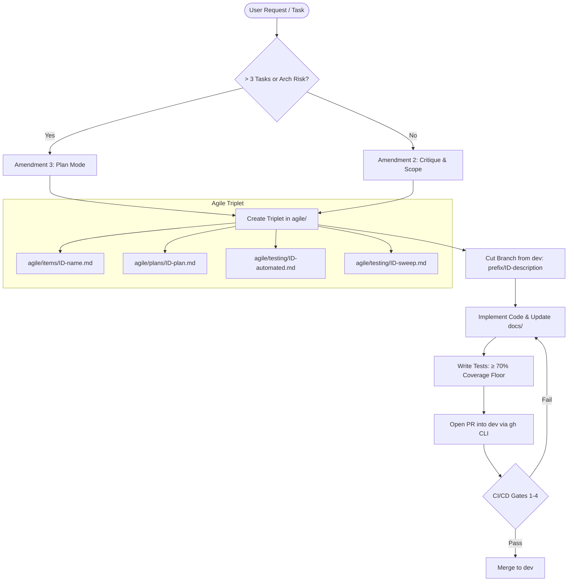
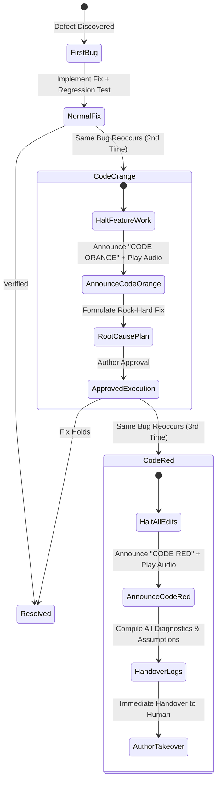
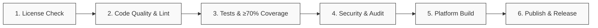

# 📜 The AI Agent Constitution & Binding Amendments

[](#-ratification--the-frozen-core)
[](#-core-philosophy--scope)
[](#3-software-craftsmanship--testing-rigor)
[](#4-agile-architecture--git-flow)
[](#cicd-ordered-gates)

> **A stack-agnostic, project-agnostic constitutional framework and operational rulebook for autonomous AI coding agents.**

---

## 📑 Table of Contents

- [Overview & Purpose](#-overview--purpose)
- [Core Philosophy & Scope](#-core-philosophy--scope)
- [Ratification & The Frozen Core](#-ratification--the-frozen-core)
- [The 20 Ratified Amendments](#-the-20-ratified-amendments)
  - [1. Operational Discipline & Communication](#1-operational-discipline--communication)
  - [2. Safety, Permissions & Asset Protection](#2-safety-permissions--asset-protection)
  - [3. Software Craftsmanship & Testing Rigor](#3-software-craftsmanship--testing-rigor)
  - [4. Agile Architecture & Git Flow](#4-agile-architecture--git-flow)
  - [5. Ambient Feedback & Tooling](#5-ambient-feedback--tooling)
- [Lifecycle Workflows & Architecture](#-lifecycle-workflows--architecture)
  - [The Development Triplet Workflow](#the-development-triplet-workflow)
  - [Regression Escalation Protocol](#regression-escalation-protocol)
  - [CI/CD Ordered Gates](#cicd-ordered-gates)
- [Project Layout & Artifact Standards](#-project-layout--artifact-standards)
  - [The `agile/` Work Item Triplet](#the-agile-work-item-triplet)
  - [Branch Naming Taxonomy](#branch-naming-taxonomy)
  - [Audio State Dispatcher](#audio-state-dispatcher)
- [Agent Operational Quick Reference](#-agent-operational-quick-reference)
- [Adopting in Your Repositories](#-adopting-in-your-repositories)
  - [1. Link the Central Constitution](#1-link-the-central-constitution)
  - [2. Multi-Harness Configuration Snippets](#2-multi-harness-configuration-snippets)
- [Contributing & Amendment Lifecycle](#-contributing--amendment-lifecycle)
- [License](#-license)

---

## 🎯 Overview & Purpose

As AI coding agents take on complex engineering tasks across multi-repository workspaces, standard prompt instructions often break down:
- Agents make assumptions when specifications are ambiguous.
- Destructive commands (`rm -rf`, hard resets) destroy uncommitted human work.
- Code changes bypass version control and test coverage standards.
- Regressions are patched with symptomatic fixes rather than root-cause remediation.
- Project documentation drifts out of sync with codebases.

**The AI Agent Constitution ([`AMENDMENTS.md`](./AMENDMENTS.md))** is a single, binding source of truth that governs how AI agents interact with codebases, file systems, Git repositories, CI/CD pipelines, and human authors. It turns loose conventions into strict, repeatable, and verifiable rules.

---

## 🏛️ Core Philosophy & Scope

1. **Stack-Agnostic & Project-Agnostic:** Specifies *what must be true*, never which language, framework, or cloud vendor makes it true.
2. **Centralized Authority:** Lives in one central repository (`AI_Docs` / `constitution`) and is linked into downstream projects via `docs/AMENDMENTS.md`. Projects do not keep divergent, unmaintained local copies.
3. **Additive-Only Rules:** A new amendment never silently overrides an earlier rule. All changes and repeals must be explicitly documented.
4. **Composability:** Amendments compose as a unified system rather than a disconnected checklist.

---

## 🔒 Ratification & The Frozen Core

As of **2026-08-14**, **Amendments 1 through 20 are permanently ratified and frozen**.
- **Agent Modification Forbidden:** AI agents may never reword, clarify, soften, or alter frozen amendments.
- **Precedence:** If a proposed change conflicts with a frozen amendment, the agent must immediately pause, flag the exact conflict, and await author instructions.

---

## 📜 The 20 Ratified Amendments

*Click any amendment title to view the full canonical text in [`AMENDMENTS.md`](./AMENDMENTS.md).*

### 1. Operational Discipline & Communication

| # | Amendment | Core Mandate |
|---|---|---|
| **1** | [**Mandatory Briefing Format & Turn Verification**](./AMENDMENTS.md#amendment-1--mandatory-briefing-format-and-turn-verification) | Pre-execution signal verification on every turn; numbered, concise, article-stripped responses to allow direct line referencing. |
| **2** | [**Critique First, Never Assume, Warn on Harm**](./AMENDMENTS.md#amendment-2--critique-first-never-assume-warn-on-harm) | Critique requests against project ideology before coding; ask questionnaires for ambiguous details; warn on data loss, debt, or architectural risks before proceeding. |
| **4** | [**No Visual Testing / Input Hijacking Without the Wheel**](./AMENDMENTS.md#amendment-4--no-visual-testing-or-input-hijacking-without-the-wheel) | Default to headless verification. No browser automation, UI clicking, or window-focus stealing unless the author explicitly yields control (*"I leave the wheel for you"*). |
| **8** | [**Common Sense First; Ask Only for Author-Owned Decisions**](./AMENDMENTS.md#amendment-8--common-sense-first-ask-only-for-author-owned-decisions) | Agents resolve *craft unknowns* (naming, standard patterns) independently; agents only prompt the author for *author-owned decisions* (business logic, trade-offs, scope). |

### 2. Safety, Permissions & Asset Protection

| # | Amendment | Core Mandate |
|---|---|---|
| **5** | [**Try Hard Before Asking; Sudo is Granted**](./AMENDMENTS.md#amendment-5--try-hard-before-asking-sudo-is-granted) | Agents must exhaust reasonable alternatives before escalating. Passwordless `sudo` is logged to `~/.claude/sudo-commands` via append-only hooks. |
| **6** | [**Zero-Deletion Policy & Command Safety**](./AMENDMENTS.md#amendment-6--nothing-is-deleted-nothing-dangerous-is-run) | Authored content is **never deleted**. Deprecated files are moved to `~/claudetrashbin` for human review. Dangerous commands (`dd`, `mkfs`, raw piping into bash, firewall tampering) are strictly forbidden. |
| **17** | [**Installed CLIs for Version Control**](./AMENDMENTS.md#amendment-17--use-the-installed-clis-for-all-version-control-work) | All Git and forge tasks must use the native Git CLI and GitHub CLI (`gh`). State is read directly, never assumed. |

### 3. Software Craftsmanship & Testing Rigor

| # | Amendment | Core Mandate |
|---|---|---|
| **3** | [**Plan Mode for Multi-Step Work**](./AMENDMENTS.md#amendment-3--plan-mode-for-multi-step-work) | Requests involving >3 distinct tasks or high architectural risk require planning mode before touching any files. Approved plans become scope boundaries. |
| **7** | [**Craft: Clean Code, Right-Sized Architecture**](./AMENDMENTS.md#amendment-7--craft-clean-code-right-sized-architecture) | Strict adherence to SOLID/DRY principles. No dead code, god objects, or speculative over-engineering (no unnecessary factories, interfaces for single implementations, etc.). |
| **9** | [**Regression Escalation Protocol**](./AMENDMENTS.md#amendment-9--regression-escalation-code-orange-then-code-red) | **1st occurrence:** Standard fix with regression test. <br>**2nd occurrence:** `CODE ORANGE` — halt feature work, diagnose root cause, deploy rock-hard fix. <br>**3rd occurrence:** `CODE RED` — immediate handover to human author with full diagnostic logs. |
| **10** | [**Test Coverage Floor: 70%**](./AMENDMENTS.md#amendment-10--test-coverage-floor-70-of-our-own-code) | Minimum **70% test coverage** on first-party code across all layers. Tests that don't assert are forbidden. Fixes must include regression tests. |

### 4. Agile Architecture & Git Flow

| # | Amendment | Core Mandate |
|---|---|---|
| **11** | [**`docs/` Exists & Stays True**](./AMENDMENTS.md#amendment-11--docs-exists-in-every-repository-and-stays-true) | Every repo maintains a living `docs/` folder with architectural decisions and system specs. Staleness is treated as a defect; docs are updated in the same change as code. |
| **12** | [**`agile/` Work Item Triplets**](./AMENDMENTS.md#amendment-12--agile-holds-work-items-plans-and-test-plans) | Strict documentation tree using `FEAT-###`, `TASK-###`, `BUG-###`. Every item must have its Item, Plan, and dual Test Plans (automated + manual sweep). |
| **13** | [**Conventional Branch Isolation**](./AMENDMENTS.md#amendment-13--a-branch-per-work-item-named-conventionally) | One branch per work item (`feature/FEAT-###-desc`, `bugfix/BUG-###-desc`). All branches branch from `dev` (hotfixes from `main`). |
| **14** | [**Git Flow & PR-Only Gateways**](./AMENDMENTS.md#amendment-14--git-flow-protected-branches-prs-only) | `main` and `dev` are protected. No direct commits or fast-forward pushes. Destructive Git commands (`git reset --hard`, `git clean`) require explicit confirmation. |
| **15** | [**Release Builds Strategy**](./AMENDMENTS.md#amendment-15--release-builds-automatic-on-main-manual-on-dev) | Merges into `main` automatically publish tagged releases. Merges into `dev` run quality gates but trigger alpha/pre-release builds manually. |
| **16** | [**Ordered CI/CD Pipeline Gates**](./AMENDMENTS.md#amendment-16--cicd-ordered-gates) | Ordered blocking verification gates: (1) License Check → (2) Code Quality → (3) Tests & Coverage → (4) Security Audit → (5) Build → (6) Release. |
| **18** | [**Session Start: Review Open PRs**](./AMENDMENTS.md#amendment-18--session-start-review-open-pull-requests-first) | Agent begins each workspace session by summarizing open pull requests, CI gate statuses, and potential merge conflicts. |

### 5. Ambient Feedback & Tooling

| # | Amendment | Core Mandate |
|---|---|---|
| **19** | [**Audio Signals for Critical States**](./AMENDMENTS.md#amendment-19--audio-signals-for-states-that-need-the-author) | Background audio playback notifies the author when they are away from screen for states like `FINISHED`, `NEED_INTERACTION`, `CONFLICT`, `CODE_ORANGE`, `CODE_RED`. |
| **20** | [**Sound Catalogue as Structured Data**](./AMENDMENTS.md#amendment-20--the-sound-catalogue-is-data-and-stays-in-sync) | Audio files live under `~/Dev/mywrok/AI_SOUNDS` in `SCREAMING_SNAKE_CASE.wav` format, mapped 1-to-1 with registered system states. |

---

## 🔄 Lifecycle Workflows & Architecture

### The Development Triplet Workflow

Every feature, task, or bug fix follows a deterministic lifecycle:



---

### Regression Escalation Protocol

When defects resurface, the agent follows Amendment 9's strict escalation hierarchy:



---

### CI/CD Ordered Gates

All pull requests pass through strict sequential gates defined in Amendment 16:



- **`dev` Target:** Runs Gates 1 through 4. Build and Alpha deployment are triggered manually.
- **`main` Target:** Runs all 6 gates sequentially. Success triggers automated tagging and release artifact publication.

---

## 📂 Project Layout & Artifact Standards

Every downstream repository managed under these amendments adopts the standard file tree:

```
<project-root>/
├── .github/
│   └── workflows/ci.yml       # Ordered CI/CD Pipeline (Amendment 16)
├── agile/                     # Amendment 12: Work Tracking
│   ├── items/                 # What & Why (FEAT-###, TASK-###, BUG-###)
│   ├── plans/                 # Architecture & Implementation Plans
│   └── testing/               # Dual Test Plans:
│       ├── <ID>-automated.md  # Unit/Integration assertion log & coverage %
│       └── <ID>-sweep.md      # Manual step-by-step test tickets
├── docs/                      # Amendment 11: Persistent Documentation
│   ├── AMENDMENTS.md          # Pointer to central constitution repository
│   ├── architecture/          # ADRs, Module Boundaries, Data Flows
│   └── ci-cd.md               # Gate definitions & tooling choices
└── src/                       # First-party source code (≥ 70% coverage floor)
```

### The `agile/` Work Item Triplet

| Directory | File Pattern | Purpose |
|---|---|---|
| `agile/items/` | `FEAT-004-split-view.md` | Problem statement, business value, acceptance criteria, dependencies. |
| `agile/plans/` | `FEAT-004-plan.md` | Architectural decisions, affected files, rollback strategy, implementation steps. |
| `agile/testing/` | `FEAT-004-automated.md` | Automated test suite breakdown and verified first-party coverage report. |
| `agile/testing/` | `FEAT-004-sweep.md` | Structured test tickets for manual human sweeps (preconditions, steps, expected vs. actual). |

---

### Branch Naming Taxonomy

Branches are strictly mapped to agile work item IDs under Amendment 13:

| Type | Branch Pattern | Example | Base Branch | Target PR |
|---|---|---|---|---|
| **Feature** | `feature/<ID>-<kebab-name>` | `feature/FEAT-042-auth-provider` | `dev` | `dev` |
| **Task / Chore** | `task/<ID>-<kebab-name>` or `chore/...` | `task/TASK-018-upgrade-deps` | `dev` | `dev` |
| **Bugfix** | `bugfix/<ID>-<kebab-name>` | `bugfix/BUG-103-null-pointer` | `dev` | `dev` |
| **Hotfix** | `hotfix/<ID>-<kebab-name>` | `hotfix/BUG-104-memory-leak` | `main` | `main` & `dev` |
| **Release** | `release/v<MAJOR.MINOR.PATCH>` | `release/v2.1.0` | `dev` | `main` |

---

### Audio State Dispatcher

Under Amendments 19 & 20, critical workflow milestones trigger background audio notifications from `~/Dev/mywrok/AI_SOUNDS`:

```bash
pw-play ~/Dev/mywrok/AI_SOUNDS/FINISHED.wav >/dev/null 2>&1 &
```

| Signal File | State / Trigger Condition |
|---|---|
| `FINISHED.wav` | Work complete; all tests passing and no blocking actions pending. |
| `NEED_INTERACTION.wav` | Agent paused waiting for a human decision or credential authorization. |
| `CALL_ME_FOR_QUESTIONARY.wav` | Paused to present an Amendment 2 multi-point clarifying questionnaire. |
| `CONFLICT.wav` | Blocked by merge conflicts or irreconcilable architecture conflicts. |
| `CODE_ORANGE.wav` | Bug reappeared after 1st fix; halting feature work for root-cause plan. |
| `CODE_RED.wav` | Bug survived 2 fixes; immediate diagnostic handover to author. |
| `RELEASE_MADE.wav` | Automated production release build deployed on `main`. |

---

## ⚡ Agent Operational Quick Reference

| Situation | Required Agent Action | Governed By |
|---|---|---|
| **Session Start** | Scan open PRs with `gh pr list`, check CI gates, and report summary before starting work. | Amendment 18 |
| **Ambiguity Detected** | Stop immediately; do not guess. Run structured questionnaire and play `CALL_ME_FOR_QUESTIONARY.wav`. | Amendments 2, 8, 19 |
| **>3 Sub-tasks or Risky Work** | Enter Plan Mode. Generate `agile/plans/ID-plan.md` before editing any codebase files. | Amendments 3, 12 |
| **Deprecated / Obsolete Files** | Never delete (`rm` / `git clean`). Move to `~/claudetrashbin` and notify author. | Amendment 6 |
| **Recurring Bug Encountered** | 2nd time: Halt & declare `CODE_ORANGE`. 3rd time: Halt all edits & declare `CODE_RED`. | Amendment 9 |
| **Test Assertions** | Ensure first-party code coverage ≥ 70%. Never pad test suite with assertions that don't verify logic. | Amendment 10 |
| **Protected Branch Edit** | Never commit or push directly to `main` or `dev`. Always branch and submit a PR via `gh pr create`. | Amendments 13, 14, 17 |

---

## 🚀 Adopting in Your Repositories

### 1. Link the Central Constitution

In each child repository, create `docs/AMENDMENTS.md` pointing to this central repository:

```markdown
# Amendments Reference

This repository operates under the canonical AI Agent Constitution:
- **Canonical Repository:** [AI_Docs (constitution)](file:///home/maxmya/Dev/mywrok/AI_Docs/AMENDMENTS.md)
- **Local Rule Pointer:** See [`AMENDMENTS.md`](file:///home/maxmya/Dev/mywrok/AI_Docs/AMENDMENTS.md) for full text.
```

### 2. Multi-Harness Configuration Snippets

Add the constitution directive to your agent's configuration file:

#### Antigravity / Gemini CLI (`GEMINI.md` or `.agents/rules/constitution.md`)
```markdown
# AI Agent Constitution Binding

You are bound by the AI Agent Constitution defined in /home/maxmya/Dev/mywrok/AI_Docs/AMENDMENTS.md.
1. All changes must satisfy Amendments 1 through 20 (Permanently Ratified & Frozen).
2. Every change must maintain the agile/ triplet (items/, plans/, testing/) and docs/ sync.
3. First-party test coverage floor is strictly 70%.
4. Protected branches (`main`, `dev`) are modified via Pull Request only (`gh pr create`).
5. Authored content must never be deleted; move deprecated files to ~/claudetrashbin.
```

#### Claude Code (`CLAUDE.md`)
```markdown
# AI Agent Constitution

Follow the rules in /home/maxmya/Dev/mywrok/AI_Docs/AMENDMENTS.md.
- Review open PRs on session start (Amendment 18).
- Plan mode for >3 tasks (Amendment 3).
- Zero deletion of authored assets; use ~/claudetrashbin (Amendment 6).
- First-party test coverage ≥ 70% (Amendment 10).
- Git Flow: cut branches from `dev`, PR back into `dev` (Amendments 13, 14).
```

#### Cursor / Windsurf (`.cursorrules` / `.windsurfrules`)
```markdown
# Constitution Rules
Always adhere to /home/maxmya/Dev/mywrok/AI_Docs/AMENDMENTS.md:
- No assumptions on ambiguous logic (Amendment 2).
- Zero deletion policy; move to ~/claudetrashbin (Amendment 6).
- ≥70% test coverage floor on first-party source code (Amendment 10).
- Maintain agile/ triplet (items, plans, testing) per work item (Amendment 12).
```

---

## 🤝 Contributing & Amendment Lifecycle

- **Proposing Amendments:** New amendments (Amendment 21+) must be proposed via Pull Request to this repository.
- **Additive Consistency:** Proposed amendments must not weaken or conflict with Amendments 1–20.
- **Ratification:** Amendments become binding only when explicitly ratified and frozen by the author.

---

## 📄 License

This governance standard is open-sourced under the **MIT License**. You are free to adopt, modify, and reference this constitution across all your AI-assisted engineering projects.

